# Architecture de l'Écosystème SoundSpot

Pour offrir une vision claire de ce système complexe qui mêle réseau local, flux audio temps réel et Web3 (Nostr/IPFS), l'architecture est divisée en trois couches logiques.

### 1. Topologie des Nœuds, Services et Protocoles

Ce schéma montre "qui fait quoi" au sein du réseau local et d'où proviennent les composants.

```text[ RÉSEAU AMONT (Internet / qo-op) ] ◄── IPFS P2P ──► [ BRAIN-NODES UPLANET ]
                  │                                         (Swarm IA / Ollama / Strfry)
                  │ wlan0 (Client WiFi)
                  ▼
╔════════════════════════════════════════════════════════════════════════════════════╗
║ MAÎTRE SOUNDSPOT (RPi 4 ou plus recommandé )                                       ║
║ Provenance : deploy_on_pi.sh --master + install_picoport.sh                        ║
╟────────────────────────────────────────────────────────────────────────────────────╢
║ 🌐 RÉSEAU & WEB             🎵 AUDIO                        🪐 WEB3 & CAPTEURS     ║
║ ├─ hostapd (AP uap0)        ├─ icecast2 (TCP:8111)          ├─ ipfs (Libp2p:4001)  ║
║ ├─ dnsmasq (DHCP/DNS:53)    ├─ ffmpeg (Décodeur)            ├─ picoport.sh         ║
║ ├─ iptables (NAT/Portail)   ├─ snapserver (TCP:1704)        ├─ upassport (54321)   ║
║ └─ lighttpd (HTTP:80)       ├─ snapclient (Local)           ├─ fleet_relay (9999)  ║
║                             ├─ wireplumber / pipewire       ├─ mon-oeil.py (Cam)   ║
║                             └─ bt-autoconnect (D-Bus)       └─ battery_monitor (I2C║
╚══════════════════════════════╦═════════════════════════════════════╦═══════════════╝
                               │ WiFi : SPOT_NAME (ZICMAMA)          │
       ┌───────────────────────┼─────────────────────────┐           │
       ▼                       ▼                         ▼           ▼
╔═══════════════╗    ╔═════════════════╗    ╔═════════════════╗  ╔═════════════════╗
║ PC DJ         ║    ║ SATELLITE RPI   ║    ║ SMARTPHONE      ║  ║ NŒUD ÉNERGIE    ║
║ (Linux)       ║    ║ (Pi Zero 2W)    ║    ║ (Android / iOS) ║  ║ (Pi Zero)       ║
╟───────────────╢    ╟─────────────────╢    ╟─────────────────╢  ╟─────────────────╢
║ Prov:         ║    ║ Prov:           ║    ║ Prov:           ║  ║ Prov:           ║
║ dj_mixxx_...  ║    ║ deploy_on_pi.sh ║    ║ App Store       ║  ║ Custom / Flash  ║
║               ║    ║ --satellite     ║    ║                 ║  ║                 ║
║ Services:     ║    ║ Services:       ║    ║ Apps:           ║  ║ Services:       ║
║ ├─ Mixxx      ║    ║ ├─ snapclient   ║    ║ ├─ Navigateur   ║  ║ ├─ Relais DC    ║
║ └─ snapclient ║    ║ ├─ pipewire     ║    ║ ├─ Snapdroid    ║  ║ └─ ADC / INA219 ║
║               ║    ║ ├─ fleet_listen ║    ║ └─ Zelkova (ẑen)║  ║                 ║
║ Flux:         ║    ║ └─ bt-autoconn  ║    ║ Flux:           ║  ║ Flux:           ║
║ ├─ TCP:8111   ║    ║ Flux:           ║    ║ ├─ HTTP:80      ║  ║ ├─ HTTP POST    ║
║ └─ TCP:1704   ║    ║ ├─ TCP:1704     ║    ║ ├─ TCP:1704     ║  ║ └─ WS:9999      ║
╚═══════════════╝    ║ └─ WS:9999      ║    ║ └─ Nostr (WSS)  ║  ╚═════════════════╝
                     ╚═════════════════╝    ╚═════════════════╝
```




```mermaid
flowchart TB
    subgraph DJ["💻 Poste DJ (PC Linux)"]
        direction TB
        M[Mixxx]:::ext
        SC_DJ[Snapclient<br/>Retour casque]:::ss
        Z[zicmama_play.sh]:::ss
    end

    subgraph MASTER ["👑 MASTER (RPi 4/5)"]
        direction TB
        AP[uap0 / hostapd / dnsmasq<br/>Réseau ZICMAMA]:::ss
        ICE[Icecast2 :8111<br/>Ingestion Audio]:::ext
        SNAP[Snapserver :1704<br/>Distribution Synchro]:::ext
        PORTAL[Lighttpd :80<br/>Portail Captif / API Bash]:::ss
        OEIL[mon-oeil.py<br/>Caméra & IA]:::ss
        PICO[picoport.sh :12345<br/>IPFS + g1cli]:::astro
        RELAY[fleet_relay.py :9999<br/>Relais NOSTR local]:::ss
    end

    subgraph ENERGY["🔋 NŒUD ÉNERGIE (Pi Zero)"]
        direction TB
        BATT[battery_monitor.py<br/>INA219 via I2C]:::ss
        GPIO[Relais DC<br/>GPIO 17]:::hw
        FL_E[fleet_listener.sh<br/>Mode: IS_ENERGY=True]:::ss
    end

    subgraph SATS["📡 SATELLITES (Pi Zero / Smartphones)"]
        direction TB
        SC_SAT[Snapclient :1704]:::ext
        PW[PipeWire / BlueZ]:::ext
        FL_S[fleet_listener.sh]:::ss
        ZELK[Ẑelkova / Multipass<br/>App Android]:::astro
    end

    subgraph SWARM["🌌 ESSAIM UPLANET (P2P)"]
        OLLAMA[Brain-Node Ollama<br/>IA LLaVA]:::astro
        STRFRY[Relais NOSTR global<br/>wss://relay.copylaradio.com]:::astro
    end

    %% Connexions principales
    DJ -- "Ogg Vorbis (TCP/8111)" --> ICE
    MASTER == "Snapcast (TCP/1704)" === SATS
    MASTER -. "Tunnels IPFS P2P" .-> SWARM
    ENERGY -- "Alerte Extinction (HTTP POST)" --> PORTAL
    MASTER == "Flotte NOSTR (WS/9999)" === ENERGY
    MASTER == "Flotte NOSTR (WS/9999)" === SATS

    %% Légende et Provenance
    classDef ss fill:#161622,stroke:#4ecdc4,stroke-width:2px,color:#fff;
    classDef astro fill:#1c1c2e,stroke:#ffd700,stroke-width:2px,color:#fff;
    classDef ext fill:#0a0a0f,stroke:#7a7a99,stroke-width:1px,color:#ccc;
    classDef hw fill:#453d3f,stroke:#ff6b6b,stroke-width:2px,color:#fff;
```

### 2. Le Pipeline des Flux Audio

Il est crucial de comprendre que le système gère deux couches audio distinctes :
1. **La Couche Radio (Multicast/Snapcast)** : Jouée sur *toutes* les enceintes connectées en même temps (Mix DJ, Micro ambiance).
2. **La Couche Locale (PipeWire)** : Mixée localement et jouée *uniquement* sur l'enceinte de l'appareil (Alertes, Jukebox, Clocher).

```text
 [ DJ Mixxx ] ────────(Ogg Vorbis)─────────┐ 
                                           ▼ 
                                   [ Icecast (Port 8111) ] 
                                           │
                                           ▼
                                   [ soundspot-decoder ]
                                   (Processus ffmpeg)
                                           │
 [ Micro USB / ] ──────(ALSA)─────┐        ▼ (PCM Brut)
 [ ReSpeaker   ]                  │     /dev/shm/snapfifo
                                  ▼        │
                         /dev/shm/snapfifo_mic
                                  │        │
                                  ▼        ▼
 ┌─────────────────────────────────────────────────────────────┐
 │                      SNAPSERVER (:1704)                     │◄────(Radio)
 └────┬───────────────────────────┬───────────────────────┬────┘
      │                           │                       │
      ▼                           ▼                       ▼
 [ Snapclient MAÎTRE ]    [ Snapclient SATELLITE ]  [ Snapdroid (Smartphone) ]
      │                           │                       │
      │   ┌──────────────┐        │                       ▼
      ├──►│ PIPEWIRE     │        │                   Haut-Parleurs
      │   │ (Serveur Son)│        │                   Téléphone
      │   └──────┬───────┘        ▼
      │          │            PIPEWIRE ────────► ENCEINTE BLUETOOTH B
      │          │
      │          │◄────(Alertes locales)
      │          ├─ [ idle_announcer.sh ] (Clocher, espeak-ng, Bip 429Hz)
      │          ├─ [ play_welcome.sh ]   (Caméra mon-oeil)
      │          ├─ [ battery_monitor ]   (Alerte vocale batterie faible)
      │          └─ [ jukebox_player ]    (Musique demandée via Nostr)
      │
      ▼
 ENCEINTE BLUETOOTH A
```



```mermaid
flowchart LR
    %% Sources Audio
    subgraph SOURCES ["🎤 Sources Audio (Inputs)"]
        DJ_STREAM(Mixxx Live DJ) -->|HTTP 8111| ICECAST{Icecast2}
        MIC(Micro USB) -->|ALSA| MIC_CAP[mic_capture.sh<br/>FFmpeg]
        JUKEBOX(Jukebox / MP3 IPFS) -->|wget| PW_PLAY_J[pw-play]
        TTS(IA Orpheus / Espeak) -->|WAV| PW_PLAY_T[pw-play]
    end

    %% Décodeurs et FIFOs RAM
    subgraph SHM["💾 RAM (/dev/shm FIFOs)"]
        ICECAST -->|HTTP| DECODER[decoder.sh<br/>FFmpeg]
        DECODER -->|PCM 48kHz| FIFO1((snapfifo<br/>DJ))
        MIC_CAP -->|PCM 48kHz| FIFO2((snapfifo_mic<br/>Ambiance))
    end

    %% Distribution Snapcast
    subgraph DISTRIBUTION ["🌐 Distribution (Snapserver)"]
        FIFO1 -->|Stream 1| SNAPSERVER[Snapserver :1704]
        FIFO2 -->|Stream 2| SNAPSERVER
    end

    %% Clients et Sorties Physiques
    subgraph PLAYBACK ["🔊 Lecture (Satellites & Master)"]
        SNAPSERVER -->|TCP/1704| CLIENT_M[Snapclient Master]
        SNAPSERVER -->|TCP/1704| CLIENT_S[Snapclient Satellite]
        
        PW_PLAY_J --> PIPEWIRE_M
        PW_PLAY_T --> PIPEWIRE_M
        
        CLIENT_M --> PIPEWIRE_M{PipeWire<br/>Master}
        CLIENT_S --> PIPEWIRE_S{PipeWire<br/>Satellite}
        
        PIPEWIRE_M -->|BlueZ A2DP| BT_M([Enceinte BT Master])
        PIPEWIRE_S -->|I2S/BlueZ| DAC_S([Enceinte/DAC Satellite])
    end

    classDef src fill:#1a1a24,stroke:#ffb347;
    classDef ram fill:#0f0f1a,stroke:#7fff6e;
    classDef dist fill:#1c1c2e,stroke:#b47fff;
    classDef out fill:#26263a,stroke:#4ecdc4;

    class DJ_STREAM,MIC,JUKEBOX,TTS src;
    class FIFO1,FIFO2,SHM ram;
    class SNAPSERVER dist;
    class BT_M,DAC_S out;
```

### 3. Signalisation et Automatisations (Nostr & API)

SoundSpot utilise NOSTR pour deux choses très différentes : la gestion de la **flotte locale** (Kind 9 éphémère / GitOps distribué) pour l'extinction, et l'interaction avec le **monde extérieur** (Kind 1 pour le Jukebox et les signaux de survie).

```text[ ESSAIM UPLANET (Global) ]
               wss://relay.copylaradio.com  ou Tunnels IPFS P2P
                                    ▲
      (Survie)                      │                     (Jukebox MP3)
      Kind 1                        │                        Kind 1
        │                           │                          │
[ picoport_20h12.sh ]               │               [ Navigateur Visiteur ]
(Ping quotidien, Uptime)            │               (App Zelkova / Alby)
                                    │                          │
                                    ▼                          ▼
                          [ jukebox_listener.py ] ◄──(Écoute requêtes "#youtube")
                                    │
                                    ▼
                         (Télécharge le MP3 + IPFS)
                                    │
                         (Écrit fichier .job dans Queue)
                                    │
                                    ▼
                         [ jukebox_player.sh ]


────────────────────────────────────────────────────────────────────────────────
                          [ RELAIS FLOTTE LOCAL ]
                      ws://127.0.0.1:9999 (fleet_relay.py)
                           (Événements Kind 9 purs)
───────────────────────────────────┬────────────────────────────────────────────
                                   │
      ┌────────────────────────────┼────────────────────────────┐
      ▼                            ▼                            ▼
[ fleet_listener.sh ]      [ fleet_listener.sh ]        [ fleet_listener.sh ]
    MAÎTRE                    SATELLITE(S)                 NŒUD ÉNERGIE
      │                            │                            │
      │                            │                            │
  (Si ordre=Shutdown)          (Si ordre=Shutdown)          (Si ordre=Shutdown)
  - Coupe Snapserver           - Coupe Snapclient           - Attend 15 secondes
  - S'éteint (Poweroff)        - S'éteint (Poweroff)        - Coupe le Relais DC
                                                              (Extinction totale)
      ▲
      │ (Envoie ordre Kind 9 "Shutdown" via la Clé Amiral)
      │
[ fleet_commander.sh ]
      ▲
      │ (Déclenchement API Bash)
      │
[ battery_monitor.py ]
(Si batterie < 20%)
```



```mermaid
sequenceDiagram
    autonumber
    
    box rgb(30, 30, 40) Nœud Énergie (Pi Zero)
        participant BATT as battery_monitor.py
        participant FL_E as fleet_listener (Energy)
        participant GPIO as Relais DC (GPIO 17)
    end
    
    box rgb(20, 30, 40) Master (RPi 4/5)
        participant API as API Portal (api.sh)
        participant RELAY as fleet_relay.py (Port 9999)
        participant FL_M as fleet_listener (Master)
    end
    
    box rgb(30, 20, 40) Satellites & Services
        participant FL_S as fleet_listener (Satellites)
    end

    %% Scénario Extinction Batterie Critique
    rect rgb(60, 20, 20)
        Note over BATT, GPIO: SCÉNARIO : BATTERIE CRITIQUE (< 20%)
        BATT->>BATT: Lit INA219 (Tension chute)
        BATT-)API: HTTP POST /api/shutdown (Alerte le Master)
        API->>RELAY: Publie[kind: 9] "shutdown" via fleet_commander.sh
        
        par Broadcast NOSTR
            RELAY-->>FL_M: Event "shutdown"
            RELAY-->>FL_S: Event "shutdown"
            RELAY-->>FL_E: Event "shutdown"
        end
        
        FL_M->>FL_M: systemctl stop audio... <br/> poweroff immédiat
        FL_S->>FL_S: systemctl stop audio... <br/> poweroff immédiat
        FL_E->>FL_E: Attend 15s supplémentaires (IS_ENERGY=True)
        FL_E->>GPIO: Coupe l'alimentation physique (Relais LOW)
    end

    %% Scénario Jukebox (Web3 vers Local)
    rect rgb(20, 60, 40)
        Note over BATT, FL_S: SCÉNARIO : JUKEBOX VIA MULTIPASS
        participant VIS as Visiteur (Ẑelkova)
        participant STR as Relay Global (Copylaradio)
        participant JL as jukebox_listener.py
        participant JP as jukebox_player.sh
        
        VIS-)STR: Publie[kind: 1] Tag "jukebox" + Lien YouTube
        STR-->>JL: Tunnel IPFS relaie le message au Master
        JL->>JL: Télécharge MP3 IPFS
        JL->>Queue (FS): Écrit le fichier .job (File System)
        JP->>Queue (FS): Détecte et lit le fichier .job
        JP->>JP: pw-play (Audio via PipeWire)
    end
```

### 💡 Notes d'Architecture (Ce qui fait la force du modèle) :

1. **Résilience hors-ligne :** Toute la partie gestion de flotte locale (Relais 9999 + API) fonctionne **même sans internet**. Si la box opérateur coupe, le nœud Énergie peut toujours ordonner l'extinction des satellites et se couper proprement.
2. **Découplage Web2 / Web3 :** Le Jukebox peut être alimenté de deux façons. Soit par un visiteur "Web3" (qui envoie un Kind 1 depuis le web externe via son app NOSTR), soit par un visiteur "Web2" (qui utilise le portail captif local via `api.sh?action=yt_copy`). Dans le 2ème cas, le Pi utilise ses propres clés Picoport pour simuler l'action et télécharger le fichier.
3. **Le rôle intelligent du Nœud Énergie :** Le Nœud Énergie ne prend pas de décision aveugle. Il est un client `fleet_listener` du réseau. Quand il capte l'ordre de Shutdown propagé par le maître, son code (`IS_ENERGY=True`) lui indique d'attendre que les autres RPi "informatiques" aient eu le temps d'écrire leurs caches sur les cartes SD avant de couper brutalement le courant physique. L'intégrité matérielle du cluster entier est ainsi garantie.
